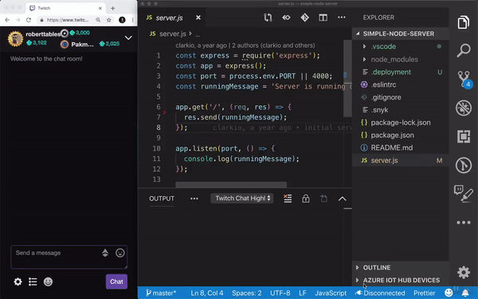
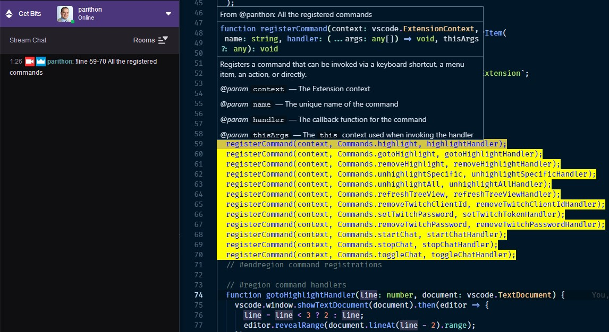

# Twitch Line Highlighter VS Code Extension

A VS Code extension to allow your Twitch viewers to help in spotting bugs, typos, etc. by sending a command in chat that will highlight the line of code they want you to check.

## Requirements

In order to use this extension you will need the following things before going to the [Getting Started](#getting-started) section:

- An installed version of [VS Code](https://code.visualstudio.com)
- A Twitch account for yourself or a separate one to be used as a chat bot ([sign up here](https://www.twitch.tv/signup))
- While logged in as your own account or as a separate account go to this site to generate a token for the chat bot: http://www.twitchapps.com/tmi
  - Save this token temporarily in a safe place as you will need it later in the [Getting Started](#getting-started) section.

## Getting Started

1. Install the extension from the [marketplace](https://marketplace.visualstudio.com/items?itemName=clarkio.twitch-highlighter)
2. Open your VS Code settings

   - Keyboard shortcut: `CTRL/CMD + ,`

3. Type in "twitch" into the search bar
4. Find the `Twitch Highlighter: Channels` setting and enter the name of the channel(s) to which you'd like the extension to connect. Example: `clarkio` If you'd like to connect to more than one channel separate them by commas `,`. Example: `clarkio,parithon`
5. Save your changes and close that tab. Go back to the Settings UI tab.
6. Find the `Nickname` setting. If you are using your own account for the chat bot then enter your account username as the value here. If you created a separate account use that username. Save your changes.
7. Make sure you're logged in to the Twitch account you wish to authorize the highlighter bot to access in your default browser.
8. In the status bar, click the "Twitch" button. After clicking it, you'll see a notification that the extension wants to open a URL.
9. Choose the "Open" option which should open a new tab of your default browser.
10. Read through the permissions that are being requested for use of this bot/extension and choose "Authorize"
11. You should then be notified that you can close the browser/tab
12. Go back to VS Code and you should now see "Disconnected" in the status bar. Click on it to Connect the bot to chat and start listening for highlight commands.

## Twitch Commands

To highlight a line, use:

        !highlight <LineNumber> OR !line <LineNumber>

To unhighlight a line, use:

        !line !<LineNumber>

To highlight multiple lines, use the same syntax as above but include a range of lines to highlight:

        !line <StartLineNumber>-<EndLineNumber>

Additionally, you can also include comments:

        !line <LineNumber> This is a comment

## Extension Settings

- `twitchHighlighter.channels`: A comma separated list of channel name(s) to connect to on Twitch. Example: 'clarkio', Another Example: 'clarkio, parithon'
- `twitchHighlighter.nickname`: The username the bot should use when joining a Twitch channel.

  > Note: this is required if you'd like to have the bot send join/leave messages in your chat. It also needs to match the Twitch username with which you generated the OAuth token.

- `twitchHighlighter.highlightColor`: Background color of the decoration (default: green). Use rgba() and define transparent background colors to play well with other decorations.

        Example: green

- `twitchHighlighter.highlightFontColor`: Font color of the decoration (default: white). Use rgba() and define transparent background colors to play well with other decorations.

        Example: white

* `twitchHighlighter.highlightBorder`: CSS styling property that will be applied to text enclosed by a decoration.
* `twitchHighlighter.announceBot`: Whether or not the bot should announce its joining or leaving the chat room.
* `twitchHighlighter.joinMessage`: The message the bot will say when joining a chat room
* `twitchHighlighter.leaveMessage`: The message the bot will say when leaving a chat room

* `twitchHighlighter.showHighlightsInActivityBar`: Show the Highlights icon in the activity bar to display the tree view.

* `twitchHighlighter.usageTip`: A tip shared by the bot when a user chats: '!line'.

## Attribution

Some of the code in this extension has been adapted from the [twitchlint extension](https://github.com/irth/twitchlint) built by [@irth](https://github.com/irth)

## Known Issues

- Extension doesn't allow specifying the file to put the highlight in. This is a work in progress.

## Release Notes

See [CHANGELOG.md](CHANGELOG.md)
